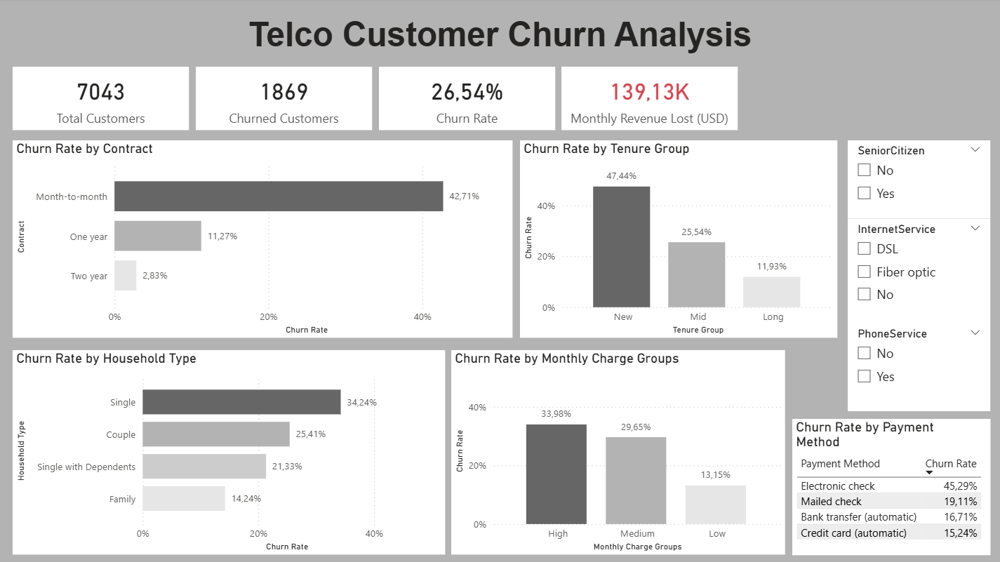
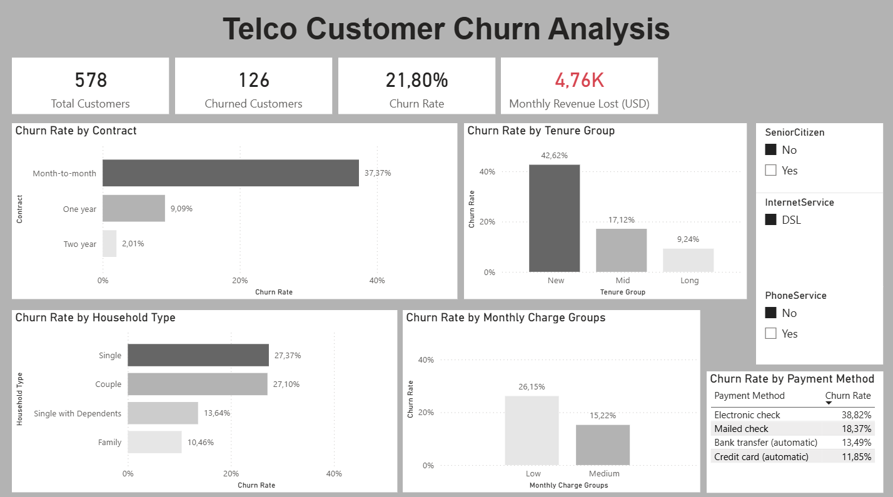

# Telco-Churn-Analysis

## Overview
This project analyzes customer churn behavior for a telecommunications company using the IBM Telco Customer Churn dataset. The goal is to identify the key factors that drive customers to cancel their service and provide actionable insights to reduce churn rate.

## Technologies
- **MySQL** — data storage, cleaning and exploratory analysis
- **Excel** — initial data exploration and preparation
- **Power BI** — interactive dashboard and data visualization

## Dataset
- **Source:** [IBM Telco Customer Churn — Kaggle](https://www.kaggle.com/datasets/blastchar/telco-customer-churn)
- **Size:** 7,043 customers | 21 features
- **Key columns:** Contract type, tenure, monthly charges, payment method, internet service, churn status

## Project Structure
```
telco-churn-analysis/
│
├── data/
│   ├── telco_churn_raw_data.csv   ← Original dataset
│   └── customers.csv              ← Cleaned dataset
├── sql/
│   ├── 01_create_database.sql     ← Database schema and import
│   ├── 02_analysis_queries.sql    ← Exploratory analysis
│   └── 03_advanced_queries.sql    ← Advanced analysis
├── powerbi/
│   └── dashboard.pbix             ← Power BI dashboard
├── screenshots/
│   └── dashboard.png              ← Dashboard preview
│   └── dashboard2.png             ← Dashboard preview with filters applied

```

## Process
1. **Data Exploration (Excel)** — Loaded the raw CSV in Excel to understand the dataset structure, data types and missing values. Checked for duplicates and verified column data integrity.
2. **Data Cleaning (Excel)** — Converted SeniorCitizen column from 0/1 to No/Yes. Grouped MonthlyCharges into three categories using the formula `IF(value>80,"High",IF(value>45,"Medium","Low"))`. Fixed decimal separator issues caused by Portuguese regional settings.
3. **Database Setup** — Imported cleaned data into MySQL and removed invisible characters from text columns
4. **SQL Analysis** — Wrote exploratory and advanced queries to identify churn patterns across multiple dimensions
5. **Dashboard** — Built an interactive Power BI dashboard with KPI cards, bar charts and slicers

## Dashboard Preview

### Overview


### With Filters Applied


## Key Insights

### 1. Contract Type is the strongest churn predictor
| Contract | Churn Rate |
|----------|------------|
| Month-to-month | 42.71% |
| One year | 11.27% |
| Two year | 2.83% |

Customers without long-term commitment are 15x more likely to churn than two-year contract customers.

### 2. New customers are the highest risk group
Customers in their first year have a **47.44% churn rate**, dropping to 11.93% after 3 years. The first 12 months are critical for retention.

### 3. Fiber optic customers churn significantly more
Despite being a premium service, fiber optic customers have a **41.89% churn rate** vs 7.40% for customers without internet service — suggesting pricing or quality concerns.

### 4. Automatic payment reduces churn by half
| Payment Type | Churn Rate |
|--------------|------------|
| Automatic | 15.98% |
| Manual | 34.67% |

Encouraging customers to switch to automatic payment could significantly reduce churn.

### 5. Monthly revenue at risk
The company loses **$139,130 USD per month** due to churned customers — highlighting the financial impact of retention strategies.

## How to Run

### MySQL
1. Run `sql/01_create_database.sql` to create the database and table
2. Import `data/customers.csv` using mysqlimport
3. Run `sql/02_analysis_queries.sql` for exploratory analysis
4. Run `sql/03_advanced_queries.sql` for advanced analysis
   
### Power BI
1. Open `powerbi/dashboard.pbix`
2. Update the MySQL connection with your local credentials
3. Refresh the data
